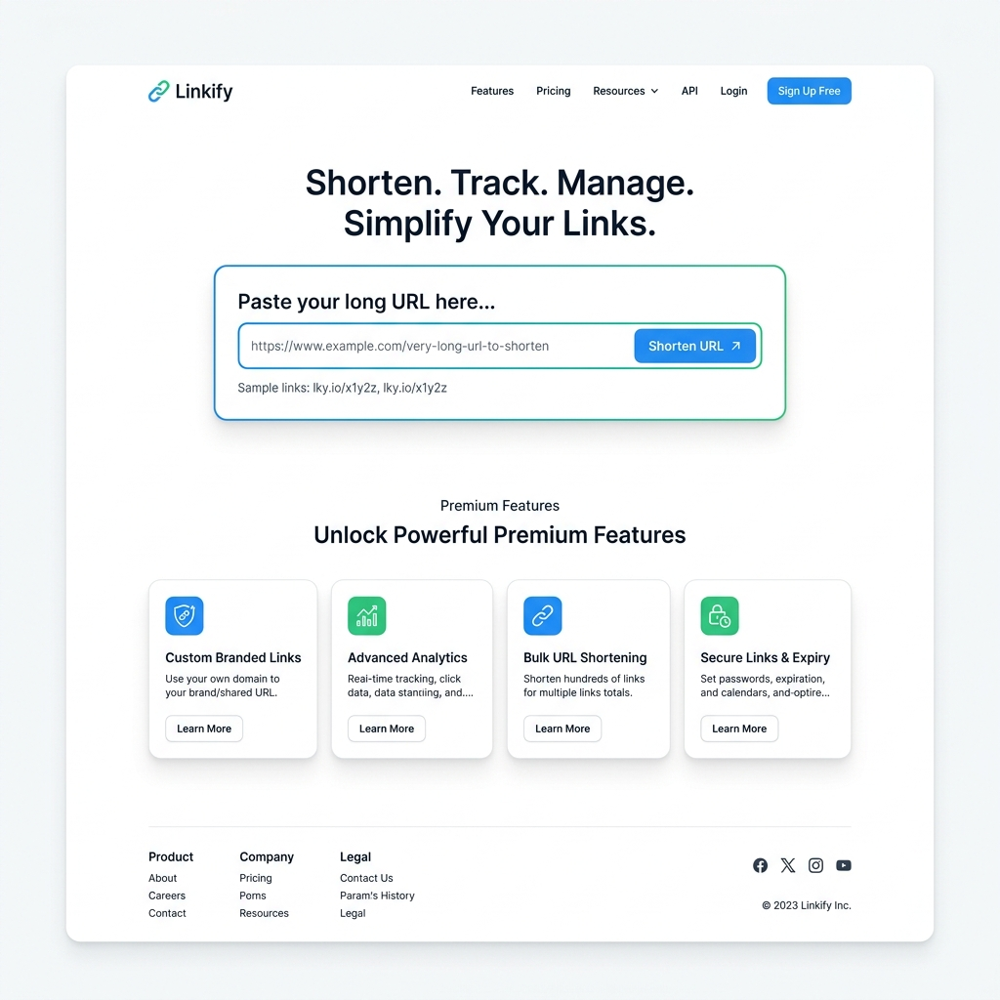
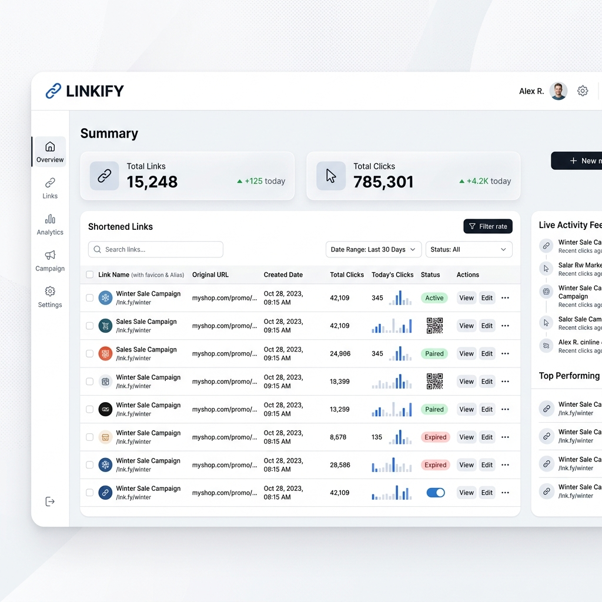

# URL Shortener

This is a professional URL shortening service built with Spring Boot 4.0 and PostgreSQL. It allows users to shorten long URLs, manage them through a personal dashboard, and track click analytics.

## Features

*   URL Shortening: Convert long URLs into compact, 6-character short codes.
*   User Authentication: Secure registration and login system.
*   Dashboard: Overview of all shortened links for the logged-in user.
*   Analytics: Detailed insights including total click counts for each link.
*   Docker Support: Easy deployment using Docker and Docker Compose.

## Screenshots

### Landing Page

### User Dashboard

## API Endpoints

### Public Endpoints
*   POST /register: Register a new user.
*   GET /login: Access the login page.
*   GET /{shortCode}: Redirect to the original URL.

### Protected API Endpoints (Require Basic Auth or Session)
*   POST /api/shorten: Create a new short URL.
    *   Body: { "mainUrl": "https://example.com" }
*   GET /api/user/links: Retrieve all links for the current user.
*   GET /api/insights/{shortCode}: Get analytics for a specific link.

## Installation and Setup

### Local Setup
1.  Clone the repository.
2.  Update the database credentials in src/main/resources/application.properties.
3.  Run the application using Maven:
    ./mvnw spring-boot:run

### Docker Setup
To run the full stack (App + PostgreSQL) using Docker:
1.  Ensure Docker and Docker Compose are installed.
2.  Run the following command:
    docker-compose up --build

The application will be available at http://localhost:8080.

## Tech Stack
*   Backend: Spring Boot 4.0, Spring Security 7.0, Spring Data JPA.
*   Database: PostgreSQL 15.
*   Frontend: HTML5, Vanilla CSS, JavaScript.
*   DevOps: Docker, Docker Compose.

## Author

Made by **Rajat Surana**

